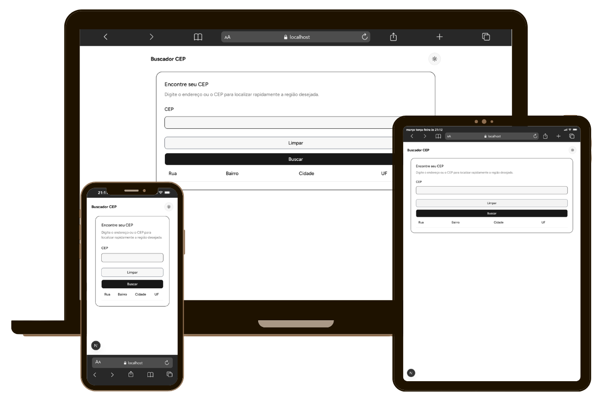

# 📮 API de Busca de CEP

Uma API moderna e prática construída com **Next.js** e **TypeScript**, que permite buscar informações de um CEP diretamente na aplicação.

Com esta API, você pode:

- Buscar CEPs digitando-os em um campo de entrada.
- Exibir uma tela de **loading** enquanto a consulta é realizada.
- Limpar os resultados da tela com um botão de **Limpar**.
- Validar o CEP digitado usando **Zod**, garantindo que apenas formatos válidos sejam consultados.
- Interface estilizada com **Tailwind CSS** e componentes de **ShadCN**.

---

## ⚡ Funcionalidades

- **Buscar CEP:** Digite o CEP e clique em "Buscar" para consultar os dados.
- **Loading:** Durante a consulta, uma animação ou mensagem de carregamento aparece.
- **Limpar:** Limpa os resultados e o campo de CEP digitado.
- **Validação:** O CEP digitado é validado com **Zod** antes da consulta.
- **UI Moderna:** Layout limpo e responsivo usando Tailwind CSS e componentes ShadCN.

---

<p align="center">
  
</p>

---

## 🖥️ Demonstração

1. Abra a página da aplicação.
2. Digite um CEP válido (ex: `01001-000`).
3. Clique em **Buscar**.
4. Veja os dados do CEP aparecerem após o carregamento.
5. Clique em **Limpar** para resetar a página.

---

## 🛠️ Tecnologias Utilizadas

- [Next.js](https://nextjs.org/) – framework React para aplicações web modernas
- [TypeScript](https://www.typescriptlang.org/) – tipagem segura e robusta
- [Zod](https://github.com/colinhacks/zod) – validação de dados
- [Tailwind CSS](https://tailwindcss.com/) – estilização rápida e responsiva
- [ShadCN](https://shadcn.com/) – biblioteca de componentes UI para React

---

## 💡 Como Usar

1. Clone o repositório:

   ```bash
   git clone https://github.com/seu-usuario/api-busca-cep.git
   ```

2. Bash

   ```bash
   npm install
   ```

3. Abra o navegador em http://localhost:3000.

4. Digite um CEP e clique em Buscar para consultar dados.

5. Use o botão Limpar para resetar a página.

## 📝 Licença

Esse projeto está sob a licença MIT. Veja o arquivo [LICENSE](LICENSE) para mais detalhes.
